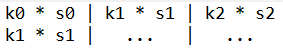

# 2D Image Convolution using MPI and AVX instructions
2D image convolution in C using MPI and AVX SIMD instructions.

## Usage and Compilation Instructions
### Image format
The format should be top-down, row-ordered and uncompressed (This can be the usual .raw files or any other file that meets these requirements). It also should not have any heading part (although you can easily tweak the code to both support arbitrary heading part and also to get info from that part). Bytes per pixel can be an arbitrary number (although it must be given as command-line argument) as long as it is the same in all pixels. Furthermore, width and height,
depending on the number of processes, must be ones such that the image can be divided in p equal rectangles.

### Compilation
This source is supposed to be working in both Windows and Linux.<br/>
I cover the only the 2 most prevalent compilers (MSVC and GCC) but you probably can get similar functionality on Clang (or any
other compiler for that matter).

#### Linux
To compile the program, you should have any standard implementation of MPI installed. The most popular implementation is the [MPICH](https://www.mpich.org/). You can find more info their page and installation instructions. The mpicc script that comes
with it on the Linux version is based on gcc. Then, to compile:
``` mpicc mpi.c -o mpi ``` <br/>

#### Windows
On Windows, things are a little bit more fucked-up. The only somewhat useful tutorial that I found was [this](https://blogs.technet.microsoft.com/windowshpc/2015/02/02/how-to-compile-and-run-a-simple-ms-mpi-program/).
Personally, I followed instructions so that I can compile on cmd (not Visual Studio). That basically means that the (least) steps
which should be done correctly are the installation and the setup of enviromental variables. <br/>
However, you should, in some way, have some version of MSVC (the Microsoft C/C++ compiler). The easiest way to get one is by installing the most minimal version of [Visual Studio](https://visualstudio.microsoft.com/vs/). Having done that, you should be able to just open one of the developer command prompts that it comes with, type ```cl``` and the compiler should just work. <br/>Then (hey, not done yet), you should be able to run a scipt like the compile.bat that I have in this repo and compile your MPI source files (then again, it's Microsoft we're talking about...).<br/>

#### SIMD version
To compile the SIMD version, first of all your CPU should support [AVX](https://en.wikipedia.org/wiki/Advanced_Vector_Extensions).
One easy way to check that is by typing ``` lscpu | grep "avx" ``` on Linux. If it returns anything, then you probably have it. <br/>
In Windows, you can run some CPU analyzer, like [CPU-Z](https://www.cpuid.com/softwares/cpu-z.html). Check on the _Instructions_ and
you should see something like _AVX_.<br/>
If none of that works, you can search about your CPU model online. <br/>
If your CPU doesn't seem to support AVX, then it may support SSE which is an older version of SIMD extensions. You can check that similarly. However, the instructions should be changed to the respective SSE counterparts (I don't include that here but you can 
easily do it by searching about SSE).<br/>
Moreover, your compiler should support AVX intrinsics (which are basically C instructions that translate directly to x86 assembly). Both MSVC and GCC support such intrinsics. <br/>

### Usage
You should run your executable through the mpiexec script, provided by the MPI implementation. A minimal execution command is something like that: <br/>
``` mpiexec -n p ./name_of_executable [input file path] [width] [height] [bytes per pixel] [convolution iterations]``` <br/>
where p is some integer that denotes the number of processes to be spawned and [] denote the respective input parameters.
<br/>

## Implementation Details
Main implementation details:
1) Structure of Data and Hanlding of edges cases. That is a problem that arises in standard, non-parallelized, non-SIMD convolution. That is because
for the convolution of 1 pixel you need its 8 surrounding pixels and there is a decision to be made on what to do on pixels
that don't have 8 surrounding pixels (i.e. corners).

The implementation uses two padding columns and two padding rows to avoid testing whether we are in an edge case or not.
These padding pixels are initialized to 0, which is usually considered black. That's the convention but you could also choose
some other color. You could also choose to consider the center pixel's color for the non-existent pixels (in this way, you would
not use padding though as you would have tests for the edge cases). Visually, if you imagine a 3x3 grayscale color image (1 byte per pixel),
the data to be processed would look something like that: <br/>


where Ai is one byte representing a color value and X some padding pixel. For a 3x3 multicolor (2-color, i.e. 2 bytes per pixel) image, we would be something like that: <br/>


Note a couple AiBi is considered **_1_** pixel. For that reason, one padding pixel is **_2_** Xs. Normally, I would use this structure for
multicolor images but because of SIMD, colors have to be split for separate processing. You can read about SIMD below for more info. The
structure that is finally used would look like that in the image: <br/>


You can see that colors have been split up (and their respective padding bytes) and now each color can be processed as single-channel
image.
<br/><br/>

Another thing that should be metioned is how data are split. This is kind of obvious. Every process has to get an equal amount
of data to process, hence the requirement that the width, height and number of processes in which the program will run have
to be some combination that makes it possible for equal split of data between them. As an example, if a 4x4 image is to be processed
by 4 processes, every process will get a 2x2 part. <br/><br/>

2) Communication and I/O. Because the program is parallel, using multiple processes, a way has to be defined in which data are distributed among these processes, the way I/O is done and how these processes communicate.

Because the source image is in a source file, I use parallel I/O routines provided by MPI and in that way, each process can
read its own part in parallel with all the other. <br/> <br/>

Communication is one of the most important implementation aspects. The main problem is that since each process has _some part_ of the
image and not the whole thing, edge cases become much more complicated. In a serial implementation, the only edge cases are those
described in 1), in which surrounding pixels don't actually exist and you have to take a decision on what to consider a surrounding pixel. <br/>
In parallel however, in the edge cases, surrounding pixels possibly exist... it's just that the process does not have access to them. <br/>
To better understand the problem, say that you have a single-channel, 4x4 image that is to be processed by 4 processes. The image looks like that: <br/>


Each process (of the 4) will get a 2x2 part. So for example, process 0 will take the top left 2x2 part: <br/>
**A1 A2** <br/>
**A5 A6** <br/>

Now, the handling of data for each process is the same as in a serial implementation, as it was described in 1). So, with 2 padding
rows and 2 padding columns, we have: <br/>


It is obvious that computing any pixel will give inaccurate results. For example, A6 _does_ have 8 surrouding pixel but they're
not accessible by this process. <br/>
For that reason, processes have to exchange their top and bottom rows and left and right colums. For example, every process
gives its last valid row (for the example, that would be A5 A6) and gets one valid row from the process below, which it places
where padding pixels where supposed to be. That accounts for a total of 4 sends and 4 receives. <br/>

But, there are a number of caveats in all of that. First, not every process has 4 neighbors. In the example with the 4x4 image in
4 processes, _no_ process has 4 neighbors. To handle that, I do some simple computations based on the process rank.<br/><br/>
Moreover, what happens with the corner data? Consider the initial image. For the convolution
of A6, you need two pixels from the process below (A9, A10), two pixels from the process on the right (A3, A7) and you would ideally
need to have the pixel A11. But, A11 is in the bottom-right process. To account for such cases, you would need to exchange data
not only "on the cross" but also diagonally. Even worse, the overhead of the communication compared to how much data you exchange (1 pixel per exchange) is massive. For that reason, I don't exchange diagonally. Instead, the corner pixels in such cases are just considered black.

Last but not least, multicolor images have to be addressed. Basically, the idea is the same. The only thing that changes is how
do you send those rows and columns, especially the rows. That is because with the SIMD structure below (i.e. colors are split), rows
are 1-color's-data-length apart. That is handled by using a suitable MPI vector type.<br/><br/>

3) Structure of Data for SIMD processing. For data to be processed using SIMD extensions, they have to follow some requirements.<br/>

SIMD is a whole topic on its own. For further info on why data is structured in a certain way, you can skim the last sections below. For a detailed description and tutorial in SIMD, read the whole thing. <br/><br/>

A tutorial introduction to SIMD in Greek.
## Σχετικά με το SIMD
SIMD = Single Instruction, Multiple Data <br/>
Αναφέρεται σε επεξεργαστές που μπορούν να προγραμματιστούν κάνοντας χρήση data-level
parallelism. Πρόκειται για την εκτέλεση μίας εντολής σε πολλαπλά δεδομένα, 
ταυτόχρονα-παράλληλα. Θα πρέπει να σημειωθεί ότι λόγω της προηγούμενης πρότασης, 
δεν είναι το ίδιο με το concurrency, στο οποίο αναφερόμαστε σε πιθανώς διαφορετικές
εντολές που εκτελούνται παράλληλα. <br/>
Πολύ συνοπτικά, η υλοποίηση τέτοιων δυνατοτήτων
γίνεται με vector registers στους επεξεργαστές, οι οποίοι είναι επέκταση των
scalar registers που έχουμε συνηθίσει. Οι scalar registers αποθηκεύουν μία τιμή
(word) τη φορά (γι' αυτό και λέγονται scalar). Αντίθετα, οι vector registers
μπορούν να αποθηκεύσουν πολλαπλά words, και έτσι η εντολή που εφαρμόζεται σε
ένα τέτοιο register, εκτελείται σε πολλαπλά δεδομένα. <br/>
Για παράδειγμα, αν ένας τυπικός scalar register αποθηκεύει έναν ακέραιο, τότε
μία εντολή not (δυαδικό συμπλήρωμα) σε έναν τέτοιο register θα επιδράσει σε έναν
ακέραιο όταν εκτελεστεί (σε αυτόν που έχει αποθηκευμένο ο register). Έτσι, έχουμε
το συμβατικό SISD = Single Instruction Single Data. Αν όμως εκτελεστεί σε έναν register
που μπορεί να αποθηκεύσει 8 words, τότε μία εντολή (Single Instruction) θα μπορεί
να εφαρμοστεί σε 8 "δεδομένα" (Multiple Data), παράλληλα, στον ίδιο αριθμό κύκλων που θα
εκτελούνταν η not σε έναν scalar register.

Σημείωση: Για το υπόλοιπο κείμενο, θεωρώ ότι 1 word = 4 bytes.

Όπως είναι προφανές, αν ένας επεξεργαστής μας παρέχει δυνατότητες SIMD, τότε πιθανώς έχουμε
τη δυνατότητα να βελτιστοποιήσουμε σημαντικά το πρόγραμμά μας.

## Μια εισαγωγή στον προγραμματισμό σε SIMD
Η χρήση του SIMD, επειδή είναι data-level parallelism, είναι μια μέθοδος βελτιστοποίησης
στην οποία θα πρέπει να αναλύσουμε (σχεδόν) μόνο τα δεδομένα. Η δομή των δεδομένων
θα μας κάνει δυνατή (ή αδύνατη) τη χρήση SIMD επεκτάσεων με τέτοιο τρόπο ώστε να
πετύχουμε κάποια σημαντική βελτίωση. Έτσι, θα πρέπει να αναλύσουμε τι χαρακτηριστικά
θα πρέπει να έχουν τα δεδομένα για να κάνουμε μια τέτοια βελτιστοποίηση.

Ας εξηγήσουμε πρώτα πως λειτουργεί διαισθητικά μια επεξεργασία με SIMD επεκτάσεις ώστε
να καταλάβουμε μετά τη δομή που θα πρέπει να έχουν τα δεδομένα για να μπορούν να περάσουν
από αυτή.
Το πρώτο κομμάτι περιλαμβάνει τη φόρτωση ενός μέρους των δεδομένων από κάποιο σημείο 
της μνήμης σε ένα
register, ώστε να μπορέσουμε μετά να τα επεξεργαστούμε μέσω αυτού. Για να γίνει αυτό, σε
επίπεδο εντολών assembly, χρειαζόμαστε κάποιο register και κάποια θέση μνήμης απ' την οποία
θα φορτώσουμε δεδομένα, όπως και σε scalar φορτώσεις. Μόνο που όπως και στις scalar
φορτώσεις, τα δεδομένα θα πρέπει να είναι _ισομοιρασμένα_ σε _συνεχόμενες_ θέσεις μνήμης (αυτό θα γίνει πιο εύκολα κατανοητό σε λίγο).
Το πόσα δεδομένα να φορτώσω εξαρτάται από το τι χωρητικότητα έχουν οι καταχωρητές (το οποίο εξαρτάται απ' τον επεξεργαστή).<br/>
Οπότε, αν θέλω
να φορτώσω 4 words στον register r11 από κάποια θέση μνήμης rsp - 8,
η εντολή θα είναι (ας πούμε) κάπως έτσι: ``` l4w r11, rsp - 8 ``` <br/>
Δηλαδή, τα 4 words θα πρέπει να είναι στα 16 _συνεχόμενα_ bytes που ξεκινούν απ' τη θέση rsp - 8. Επίσης, τα δεδομένα θα πρέπει
να είναι "ίδια" (ισομοιρασμένα), με την έννοια ότι σε μία εντολή φόρτωσης, ζητάω, 4/8/... words ή 4/8/... floats αλλά δε μπορώ π.χ. με μία εντολή να φορτώσω 2 floats, 1 char κι ένα double.<br/>
Σημείωση: Αυτή δεν είναι πραγματική εντολή, τη χρησιμοποιώ για ευκολία. <br/>

1) Άρα, το πρώτο χαρακτηριστικό που πρέπει να έχουν τα δεδομένα είναι ότι θα πρέπει
να μπορούν να διαμοιραστούν σε μικρά _ισόποσα_ κομμάτια τα οποία επίσης μπορούν να τοποθετηθούν με _συνεχόμενο_ τρόπο στη μνήμη.

Μετά, θα έχουμε κάποια εντολή η οποία επιδρά στα δεδομένα με κάποιο τρόπο. Για παράδειγμα,
θα προσθέσουμε τα δεδομένα 2 καταχωρητών. Για τις πράξεις και την αποθήκευση δεδομένων στους καταχωρητές υπάρχουν κάποια
conventions. Συγκεκριμένα, θεωρούμε ότι τα δεδομένα που φορτώνουμε αποθηκεύονται οριζόντια, το ένα "δίπλα" στο άλλο (όπως θα
σκεφτόμασταν ότι αποθηκεύονται σε θέσεις πίνακα). Για παράδειγμα, έστω ότι στη μνήμη, στη θέση μνήμης 0x8 ξεκινάνε 4 words, κάπως έτσι:
<br/>
`0x8:  1 ` <br/>
`0xc:  2 ` <br/>
`0x10: 3` <br/>
`0x14: 4` <br/>

και έστω ότι θέλω να τα φορτώσω στον r11 με μια εντολή κάπως έτσι: ``` l4w r11, 0xa ```.
Τότε, το conventions για το πως θα "δείχνει" ο καταχωρητής r11 (πως θα έχουν αποθηκευτεί τα δεδομένα σχηματικά) είναι κάπως έτσι: <br/>
**| 1 | 2 | 3 | 4** <br/>
Όπως είπαμε δηλαδή, το ένα δίπλα στο άλλο συνεχόμενα. <br/>
Επίσης, το άλλο convention είναι ότι σκεφτόμαστε τις πράξεις σε κάποιο καταχωρητή να γίνονται σαν να εφαρμόζουμε την εκάστοτε
πράξη σε κάθε θέση (δεδομένο) του καταχωρητή ξεχωριστά. Για παράδειγμα, η ``` not r11 ```
θα άφηνε τον καταχωρητή με την 1h θέση να είναι το αντίστοιχο του ``` not 1 ```, τη 2η το ``` not 2 ``` κλπ.<br/>
Το 3ο convention είναι ότι σκεφτόμαστε τις πράξεις μεταξύ (2) καταχωρητών να γίνονται "κάθετα", στις αντίστοιχες θέσεις μνήμης των 2 καταχωρητών. Για παράδειγμα έστω ότι ο r1 έχει τα εξής:
<br/>
**| 1 | 2 | 3 | 4** <br/>
και ο r2 τα εξής:
<br/>
**| 5 | 6 | 7 | 8** <br/>
Τότε, μία εντολή πρόσθεσης, π.χ. ``` add r3, r1, r2 ``` θα άφηνε στην κάθε θέση του r3 το αποτέλεσμα της πράξης στα δεδομένα των
αντίστοιχων θέσεων των αρχικών καταχωρητών, δηλαδή:
<br/>
**| 1 + 5 | 2 + 6 | 3 + 7 | 4 + 8** <br/>

Μετά, η συμμετρική διαδικασία της φόρτωσης είναι αυτή της επανατοποθέτησης των δεδομένων
στη μνήμη, κάτι που σχεδόν πάντα, αν μπορούμε να τα χουμε δομήσει ώστε να μπορούμε να τα
φορτώσουμε, τότε μπορούμε και να τα αποθηκεύσουμε εύκολα. Αλλά αυτό δεν είναι απαραίτητο. <br/>
Η επανατοποθέτηση, όπως θα περίμενε κανείς, γίνεται με παρόμοιο τρόπο. Αποθηκεύουμε συνεχόμενα τα δεδομένα ενός καταχωρητή, το ένα
δίπλα στο άλλο σε διαδοχικές θέσεις μνήμης.

2) Ένα δεύτερο χαρακτηριστικό που είναι κάπως εμφανές από την ίδια την περιγραφή του SIMD είναι ότι τα δεδομένα θα πρέπει να είναι ίδιου τύπου και οι πράξεις που θέλουμε να κάνουμε σ αυτά να είναι ίδιου τύπου. <br/>

Π.χ. αν έχουμε δομήσει τα δεδομένα
σαν συνεχόμενους ακέραιους, αλλά θέλουμε ανά τετράδες να κάνουμε διαφορετική πράξη
στον καθένα απ' τους 4 ακεραίους, τότε αυτή η δομή δεν ενδείκνυται για SIMD. Μια πιθανή
αλλαγή θα είναι να αναδιατάξουμε τους ακεραίους ώστε οι ακέραιοι στους οποίους θέλουμε
να κάνουμε την 1η πράξη να πάνε συνεχόμενα μαζί, στη συνέχεια να ακολουθούν αυτοί
στους οποίους θέλουμε να κάνουμε την 2η πράξη κ.ο.κ.
Με την ίδια λογική, αν έχουμε 4-άδες words συνεχόμενα στη μνήμη τα οποία θέλουμε να επεξεργαστούμε αλλά θέλουμε ανά 4-άδα, το 1ο και 3ο word να το χειριστούμε σαν ακέραιο και το 2ο και 4ο σαν float, τότε πάλι αυτή η δομή δεν ενδείκνυται για SIMD και η λύση είναι
παρόμοια με αυτή στο προηγούμενο πρόβλημα.

Σαν παράδειγμα, ένα πρόβλημα στο οποίο η ενσωμάτωση SIMD εντολών είναι εύκολη είναι αυτή
της πρόσθεσης Ν και Ν ακεραίων. Αν υποθέσουμε ότι έχουμε καταχωρητές των 4 words και ένας
ακέραιος είναι 1 word, τότε θα χρειαστούμε Ν / 4 vector πράξεις στην περίπτωση που Ν % 4 == 0.
Αν αυτό δεν ισχύει, θα χρειαστούμε επίσης Ν % 4 scalar πράξεις. Η δόμηση των δεδομένων
είναι πολύ απλή. Απλά βάζουμε τους Ν και Ν ακεραίους σε συνεχόμενες θέσεις μνήμης, τους
φορτώνουμε σε 4-άδες, προσθέτουμε (με μία εντολή) τις αντίστοιχες θέσεις των καταχωρητών
και τους επανατοποθετούμε.
Όπως καταλαβαίνουμε, σε σύγκριση με τις Ν scalar πράξεις, αυτό είναι μια πολύ μεγάλη βελτίωση.

## SIMD στη Συνέλιξη Εικόνας

Οπότε, πάμε στην δισδιάστατη συνέλιξη εικόνας. Αρχικά, ας ασχοληθούμε μόνο με τις greyscale φωτογραφίες και ας ορίσουμε τη συνέλιξη μίας διάστασης επειδή είναι πιο απλή. Η μονοδιάστατη συνέλιξη χρειάζεται 3 (συνεχόμενες στη μνήμη) source αριθμητικές τιμές και 3 αριθμητικές τιμές φίλτρου (όπως αντίστοιχα η δισδιάστατη χρειάζεται 3 * 3 source και 3 * 3 τιμές φίλτρου).
Έτσι, αν έχουμε s1, s2, s3 source και k1, k2, k3 τιμές φίλτρου, το αποτέλεσμα
dest της συνέλιξης θα είναι:
``` res = k1 * s1 + k2 * s2 + k3 * s3 ``` <br/>
όπου αυτό είναι η συνέλιξη για το στοιχείο s2, δηλαδή είναι μια συνέλιξη με τα 2 γειτονικά στοιχεία (δεξιά και αριστερά).

Σαν αρχική προσέγγιση, ας υποθέσουμε ότι έχουμε registers των 3 word (αυτό δεν υφίσταται
σε κάποια πραγματική υλοποίηση. Παρέχονται μόνο δυνάμεις του 2).

Σε αυτή την περίπτωση θα κάναμε εύκολα το κομμάτι του πολλαπλασιασμού. Θα φορτώναμε
σε έναν register τις τιμές του φίλτρου και στη συνέχεια θα φορτώναμε τριάδες source
στοιχείων. Πιο σχηματικά, ας υποθέσουμε ότι η μνήμη έχει source στοιχεία κάπως έτσι:
s0 s1 s2 s3 s4 s5 ...

Όπως αναφέρθηκε, φορτώνουμε αρχικά (1 φορά μόνο) τις τιμές του φίλτρου σε έναν καταχωρητή΄(ξεκινώντας την αρίθμηση απ' το 0): <br/>
**k0 | k1 | k2**

και μετά φορτώνουμε 3 άδες source σε καταχωρητές. Π.χ. ξεκινώντας για τον υπολογισμό του
s1, φορτώνουμε: <br/>
**s0 | s1 | s2**

Τώρα, φαίνεται ότι μπορούμε να κάνουμε ταυτόχρονα 3 πολλαπλασιασμούς (κάθετα) και ο dest register
θα έχει: <br/>
**k0 * s0 | k1 * s1 | k2 * s2**

Φαίνεται ότι κάτι γλυτώσαμε και αν είχαμε ένα τρόπο να προσθέσουμε τα στοιχεία του
καταχωρητή, τότε θα είχαμε ένα res. Όμως, υπάρχουν κάποια προβλήματα με αυτή την
υλοποίηση. Συγκεκριμένα, η βελτίωση που θα πάρουμε είναι πολύ μικρή εως τίποτα. Αυτό
γιατί αρχικά οι 3 αντί του 1ος πολλαπλασιασμού δεν είναι μεγάλη βελτίωση και κατά 2ον η οριζόντια
πρόσθεση (πρόσθεση στοιχείων ενός καταχωρητή), εκτός από δυσνόητη είναι και χρονοβόρα.
Οπότε, θα ήθελα να αναλύσω αυτή την υλοποίηση ως ένα παράδειγμα "λάθους" (ή τουλάχιστον όχι
βέλτιστης) χρήσης του SIMD. Μερικά red-flags που κατά κανόνα στο SIMD σημαίνουν
ότι κάτι δεν έχουμε κάνει με τον καλύτερο δυνατό τρόπο είναι τα εξής:

1) Έχουμε μοντελοποιήσει το πρόβλημα με οριζόντιες πράξεις κι όχι με κάθετες. Γενικά, όπως
καταλαβαίνουμε από την λειτουργία του SIMD, οι "κάθετες" πράξεις _μεταξύ_ καταχωρητών είναι πολύ
καλύτερες από τις οριζόντιες πράξεις σε _ένα_ καταχωρητή. Αυτό γιατί το σύστημα SIMD
έχει φτιαχτεί έτσι. Οπότε, ο πολλαπλασιασμός φαίνεται σωστός αλλά οι προσθέσεις όχι.

2) Δεν γίνονται όλες οι πράξεις παράλληλα. Ιδανικά, αν και δεν είναι πάντα εφικτό, θα
θέλαμε όλες οι πράξεις να γίνονται παράλληλα κι όχι μόνο ο πολλαπλασιασμός.

3) Όταν κάνουμε store, κάνουμε 1 res (για ένα στοιχείο). Σχεδόν πάντα αυτό σημαίνει κακή μοντελοποίηση.
Ιδανικά, θέλουμε μαζικά loads και μαζικά stores (και μάλιστα με κάποια σχέση αναλογίας).

Οπότε, πως λύνουμε αυτά τα προβλήματα; Απ' όσο γνωρίζω δεν υπάρχει συγκεκριμένη
μεθοδολογία αλλά κατά κανόνα, αν προσπαθήσουμε να λύσουμε το 1ο (ή/και το 2ο), τα υπόλοιπα λύνονται αυτόματα.

Ένας τρόπος να σκεφτόμαστε σε αυτό είναι ο εξής: Σίγουρα θα πρέπει να γίνει η πράξη π.χ.
k0 * s0, δηλαδή της πρώτης θέσης, οπότε ας προσπαθήσουμε με κάποιο τρόπο να βάλουμε στην ίδια θέση σε έναν άλλο καταχωρητή αυτό με το οποίο πρέπει να προστεθεί αυτή η τιμή. Αυτό
γίνεται με την εξής λογική. Από τη στιγμή που θα έχουμε single instruction, οι
πολλαπλασιασμοί θα πρέπει να γίνουν σε ένα βήμα κι οι προσθέσεις σε ένα άλλο. Αυτό δεν
είναι θέμα επιλογής, είναι μέρους της λειτουργίας του SIMD. Εφαρμόζουμε _μία_ εντολή τη φορά. Η σειρά βέβαια δεν έχει πάντα σημασία. <br/> Οπότε, αφού έχουμε βρει έναν τρόπο
να κάνουμε μαζικά τους πολλαπλασιασμούς, ας προσπαθήσουμε να κάνουμε και μαζικά προσθέσεις.<br/>
Επειδή αυτό πιθανόν να είναι δύσκολο να το σκεφτούμε απ' την αρχή, προσπαθούμε να κάνουμε
παράλληλα την πρόσθεση σε μία θέση. Λόγω της συμμετρικότητας που επιβάλλει το SIMD,
αυτό συνήθως μας κάνει εύκολο να το εφαρμόσουμε για όλες τις θέσεις.

Για παράδειγμα εδώ, πέρα απ' τον καταχωρητή πιο πάνω, θα θέλα σε ένα δεύτερο καταχωρητή να έχουμε στην 1η θέση το k1 * s1 (οι υπόλοιπες θέσεις για τώρα δε μας ενδιαφέρουν): <br/>


Αυτό δεν είναι δύσκολο να το κάνουμε προφανώς και επίσης δε θα φέρει βελτίωση. Αλλά τώρα
αρχίζει να γίνεται ενδιαφέρον αν το δούμε σχηματικά. Αρχικά, ένα πρώτο πράγμα που μπορούμε
να παρατηρήσουμε είναι ότι αφού το k1 * s1 θα είναι από "κάτω" τότε είναι άχρηστο να το
'χουμε δίπλα. Αφού σκεφτόμαστε μόνο για το s1 τώρα (δηλαδή σκεφτόμαστε να βγάλουμε ένα
res προς το παρών αλλά κάθετα), το k1 * s1 θα χρησιμοποιηθεί μία φορά, κι αποφασίσαμε να είναι
κάτω. Με την ίδια λογική το k2 * s2 θα είναι σε 3ο καταχωρητή, οπότε είναι κι αυτό άχρηστο όταν είναι _και_ δίπλα: <br/>


Οπότε τώρα, χωρίς να σκεφτούμε πολύ, είναι προφανές ότι κάτι άλλο πρέπει να μπει
στις θέσεις 2 και 3. Αν θυμηθούμε ότι προσπαθούμε να κάνουμε κάθετη την πρόσθεση
(ο πολλαπλασιασμός έχει γίνει ήδη) και παρατηρήσουμε το σχήμα, θα δούμε ότι οι 3
πρώτες θέσεις, με 2 κάθετες προσθέσεις θα μας δώσουν το dest για το s1 (αυτό στοχεύαμε
άλλωστε). Άρα, αν οι 2ες θέσεις μας δίναν το s2 και οι 3ες το s3, αυτό θα ήταν μια πολύ καλή (και αν το σκεφτούμε λίγο η βέλτιστη) δομή. Και πολύ απλά, αντιγράφωντας τις πρώτες
θέσεις για τα επόμενα s (s1, s2, s3 και s2, s3, s4) <br/>


Εδώ είναι σημαντικό να παρατηρήσουμε ότι δεν σκεφτήκαμε τίποτα πολύπλοκο και παρ' όλα αυτά
φτάσαμε σε μια βέλτιστη δομή, απλά ακολουθώντας τις πρώτες θέσεις και τη λογική του SIMD.
Τώρα φυσικά, δεν σημαίνει ότι αυτή η δομή θα είναι και εφικτή να υλοποιηθεί, αλλά και πάλι θα απλοποιήσουμε
το πρόβλημα για να το ελέγξουμε, δηλαδή: ας ξεκινήσουμε με το να φτιάξουμε τον πρώτο καταχωρητή.
Αυτό είναι πολύ εύκολο προφανώς, το 'χουμε κάνει πιο πάνω, με τους 2 καταχωρητές. Απλά
τώρα, ο καταχωρητής που είχε τις τιμές του φίλτρου, αντί να έχει τις k0, k1, k2, θα έχει
μόνο την k0.
Αντίστοιχα, φτιάχνουμε και τους άλλους 2.

Οπότε τελικά χρειαζόμαστε:
3 καταχωρητές που ο καθένας θα 'χει σε κάθε μία απ' τις 3 θέσεις μία τιμή φίλτρου,
3 καταχωρητές που θα έχουν τις τιμές s0, s1, s2 - s1, s2, s3 - s2, s3, s4

και σε πράξεις, 3 πολλαπλασιασμούς και 2 προσθέσεις, όσες δηλαδή χρειαζόμαστε για ένα
dest, αλλά εδώ θα παράγουμε 3! Αυτό είναι πολύ σημαντικό γιατί έχουμε την βέλτιστη δομή.
Αυτό το ξέρουμε γιατί με καταχωρητές των Ν θέσεων μπορούμε στην καλύτερη περίπτωση
με τον αριθμό των πράξεων που χρειαζόμαστε για ένα res, να παράξουμε Ν (δεν έχω απόδειξη
για αυτό αλλά διαισθητικά είναι προφανές).

Και έτσι, έχουμε την μονοδιάστατη συνέλιξη.

## Δισδιάστατη Συνέλιξη
Προχορώντας στην δισδιάστατη συνέλιξη, αν έχουμε καταλάβει λίγο τη λογική του SIMD, είναι
αμέσως αντιληπτό ότι έχουμε ένα σημαντικό πρόβλημα. Η 9-αδα των γειτονικών source
δεν είναι σε συνεχόμενες θέσεις μνήμης! Τώρα, μάλλον υπάρχουν καλύτερες λύσεις από αυτή
που θα προτείνω αλλά είναι η πιο εύκολη νομίζω. Συγκεκριμένα, μπορούμε εύκολα
να λύσουμε το πρόβλημα χρησιμοποιώντας την μονοδιάστατη συνέλιξη.

Έστω ότι έχουμε ένα δισδιάστατο πίνακα στοιχείων και στα οποία θέλουμε να κάνουμε δισδιάστατη συνέλιξη, αριθμημένα ως εξής: <br/>


Έστω ότι θέλουμε να υπολογίσουμε τα στοιχεία της μεσαίας γραμμής. Αν κάνουμε μονοδιάστατη συνέλιξη στα στοιχεία της 1ης γραμμής χρησιμοποιώντας τα 3 πρώτα στοιχεία του φίλτρου, έχουμε
το "πάνω" μέρος της δισδιάστατης συνέλιξης. Αντίστοιχα, στη μεσαία με τα επόμενα τρία
στοιχεία του φίλτρου έχουμε τη "μεσαία" και στην 3η, την "κάτω". Κι' αυτό ισχύει για κάθε γραμμή.

Οπότε, με 2 κάθετες προσθέσεις, έχουμε σε κάθε θέση ένα dest στοιχείο.


## Δισδιάστατη Συνέλιξη σε Πολυκάναλες Εικόνες

Φαίνεται ότι μπορούμε να εφαρμόσουμε εύκολα τα από πάνω για εικόνες grayscale. Τα source
στοιχεία είναι ακέραιοι που συμβολίζουν τα pixel και όλα δουλεύουν ακριβώς όπως πάνω.
Γενικά αυτό ισχύει για μονκάναλες εικόνες.

Το πρόβλημα είναι ότι δε δουλεύει για πολυκάναλες εικόνες. Ας σκεφτούμε ότι μια 2-κάναλη
3x3 εικόνα θα είναι κάπως έτσι:
<br/>


όπου Α και Β τα 2 κανάλια.

Αυτό όπως καταλαβαίνουμε είναι πρόβλημα γιατί τα δεδομένα δεν βρίσκονται σε συνεχόμενες
θέσεις μνήμης όπως αναφέραμε πιο πάνω. Η λύση σε αυτό το πρόβλημα είναι πολύ απλή
και πολύ διαδεδομένη, δηλαδή απλά αναδιατάζουμε τα χρώματα χωρίζοντας τα κανάλια, κάνουμε
τις πράξεις και μετά τα αναδιατάζουμε για να την αποθηκεύσουμε. Δηλαδή θα είναι κάπως έτσι: <br/>


## To AVX σύνολο επεκτάσεων (εντολές και καταχωρητές)
Τέλος, περνάμε στο τεχνικό (και βαρετό :P) κομμάτι της υλοποίησης, δηλαδή θα πρέπει να αναφέρω ποιες τεχνολογίες
μπορούν να χρησιμοποιηθούν για να υλοποιήσουμε SIMD. Για μπορέσει να γίνει λοιπόν αυτό, ο επεξεργαστής του μηχανήματος
θα πρέπει να διαθέτει δυνατότητες SIMD, το οποίο γίνεται μέσω ενός συνόλου επεκτάσεων που υποστηρίζει κάθε αρχιτεκτονική επεξεργαστή.
Για τις αρχιτεκτονικές x86 που υποστηρίζουν SIMD, υπάρχουν διάφορες επεκτάσεις. Παλιά ήταν το [SSE](https://en.wikipedia.org/wiki/Streaming_SIMD_Extensions), τώρα είναι το [AVX](https://en.wikipedia.org/wiki/Advanced_Vector_Extensions) και το [AVX512](https://en.wikipedia.org/wiki/AVX-512). Για τις ARM υπάρχει το [Neon](http://infocenter.arm.com/help/index.jsp?topic=/com.arm.doc.dht0002a/BABIIFHA.html).

Γενικά, επειδή οι εντολές SIMD είναι στην ουσία assembly γραμμένη σε κάποια γλώσσα υψηλού επιπέδου, είναι άπειρες. Υπάρχουν πάρα
πολλές λεπτομέρειες που δε θα αναλύσω εδώ. θα αναφερθώ μόνο στα σημαντικά κομμάτια αυτής της υλοποίησης. Για περισσότερες πληροφορίες
μπορείτε να δείτε τα λινκ παραπάνω και επίσης: <br/>
[Introduction to Intel AVX](https://software.intel.com/en-us/articles/introduction-to-intel-advanced-vector-extensions),<br/>
[Intel Intrinsics Guide](https://software.intel.com/sites/landingpage/IntrinsicsGuide/) <br/>
και το όχι άμεσα σχετικό αλλά απαραίτητο για οτιδήποτε έχει να κάνει με low-level: <br/>
[Intel Software Developer Manual](https://software.intel.com/en-us/articles/intel-sdm) <br/>

Εν συντομία, το AVX μας παρέχει καταχωρητές των 256 bit (8 words) και τις εξής δυνατότητες: <br/>
 * ```__m256 x;```: Ορισμός μεταβλητών που αντιστοιχούν σε AVX καταχωρητές.
 * ```_mm256_set1_ps(float a)```: Ανάθεση σε όλες τις θέσεις ενός καταχωρήτη (αυτού στον οποίο επιστρέφουμε) την τιμή a.
 * ```_mm256_setzero_ps()```: Ανάθεση της μηδενικής τιμής σε έναν καταχωρητή (σ' αυτόν που επιστρέφουμε).
 * ```_mm256_loadu_ps(float const *memaddr)```: Unaligned φόρτωση 8 floats από την θέση memaddr στον καταχωρητή στον οποίο επιστρέφουμε.
 * ```_mm256_mul_ps(__m256 a, __m256 b)```: Πολλαπλασιασμός 2 καταχωρητών (κάθετα) και επιστροφή του αποτελέσματος.
 * ```_mm256_add_ps(__m256 a, __m256 b)```: Πρόσθεση 2 καταχωρητών (κάθετα) και επιστροφή του αποτελέσματος.
 * ```_mm256_store_ps(float *memaddr, __m256 a)```: Aligned Αποθήκευση των τιμών του καταχωηρητή a σε συνεχόμενες θέσεις μνήμης.
 * ```_mm256_storeu_ps(float *memaddr, __m256 a)```: Unaligned Αποθήκευση των τιμών του καταχωηρητή a σε συνεχόμενες θέσεις μνήμης ξεκινώντας από την θέση memaddr.
 
Υπάρχουν κάποιες σημαντικές λεπτομέρειες για τη χρήση του AVX. Η πρώτη σημαντική λεπτομέρεια είναι ότι τα δεδομένα είναι floats (1 τιμή χρώματος = 1 float) ενώ στην πραγματικότητα χωράει απλά σε ένα byte. Αυτό γιατί οι επεκτάσεις είναι ιδιαίτερα αποτελεσματικές και εύχρηστες στην χρήση float δεδομένων. Να σημειωθεί ότι φυσικά αυτό σημαίνει ότι χρησιμοποιούμε την τετραπλάσια μνήμη. 
Επίσης, στη φόρτωση και αποθήκευση τιμών, έχει σημασία αν η θέση μνήμης
θα είναι aligned (με κάποια τιμή) ή unaligned. Μία θέση μνήμης memaddr είναι aligned με κάποια τιμή x όταν memaddr % x == 0, δηλαδή όταν η memaddr είναι πολλαπλάσιό της. <br/>
Στην περίπτωση που είναι aligned (και μπορεί να προβλευθεί οπότε και χρησιμοποιούμε την ανάλογη εντολή), τότε έχουμε performance benefit. Στο AVX, οι θέσεις μνήμης θεωρούνται aligned όταν είναι πολλαπλάσια του 32. Γι' αυτό το λόγο υπάρχουν ανάλογες εντολές προς
τον compiler (σε περίπτωση μεταβλητών στη στοίβα και ανάλογα με τον compiler) ή προς το OS (σε περίπτωση δέσμευσης μνήμης στο heap και ανάλογα με το OS). <br/>
Γενικά, λόγω του performance benefit προσπαθούμε να το επιτύχουμε όποτε είναι εφικτό. Για παράδειγμα στη μονοδιάστατη συνέλιξη, θα μπορούσαμε να έχουμε κάθε γραμμή αποθηκευμένη 4 φορές στη μνήμη. Η αρχή της κάθε μίας θα ήταν aligned και έτσι θα είχαμε _και_ aligned loads, με το ανάλογο memory cost βέβαια.
Θεωρώ πως οι υπόλοιπες λεπτομέρειες του κώδικα μπορούν να γίνουν αντιληπτές απλά διαβάζοντάς τον.
